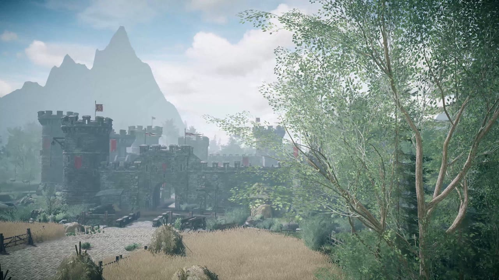
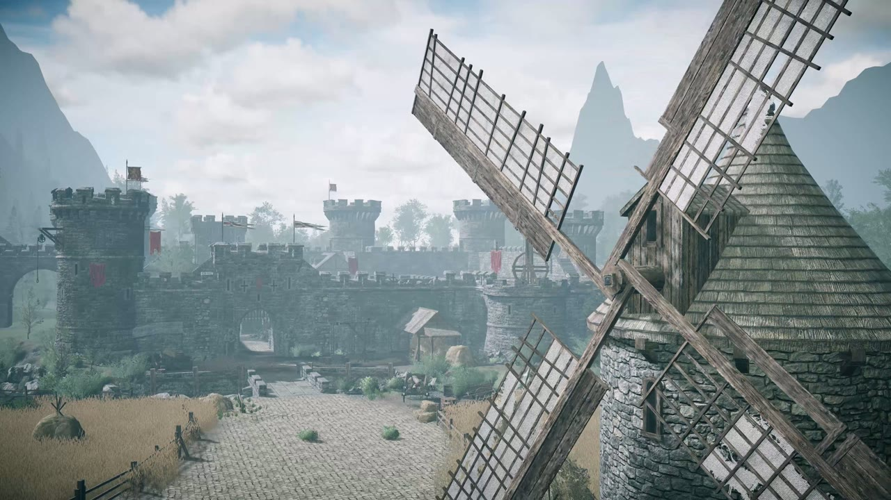
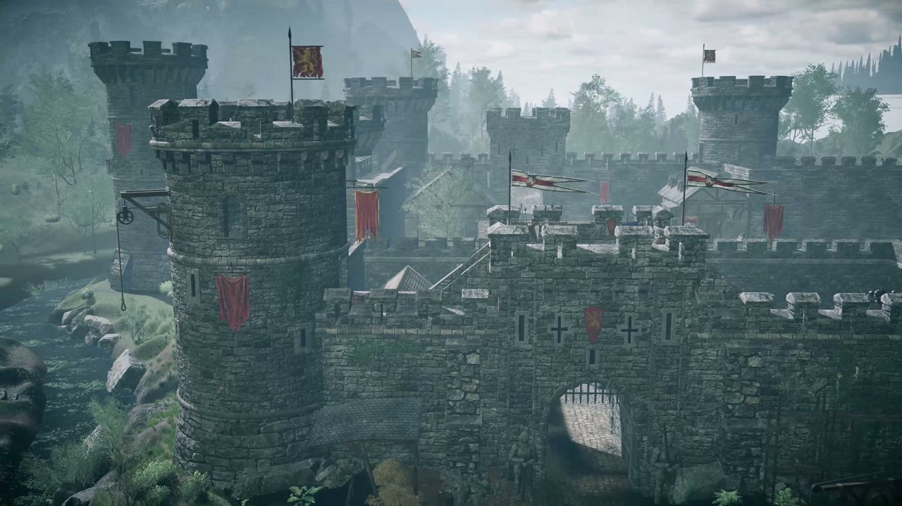

# Unstable Horse Game

**A 2-player online co-op action-puzzle game made in Unity 6.** Each player rides a horse, and the two horses are joined by a physical iron chain. The chain is your weapon *and* your main tool: swing it through enemies, drag crates with it, and stay coordinated or get pulled off balance.

| | |
|---|---|
|  |  |

Frames from the in-game intro cinematic that flies over the castle level (environment art: *The Modular Medieval Castle* asset pack).

---

## Gameplay

- **Co-op on a chain:** two players, two horses, one iron chain between them. Movement, combat and puzzles all depend on the chain's physics.
- **Castle level:**
  - Fight waves of spear-throwers and wolves by swinging the chain through them.
  - Drag crates, and ride moving platforms and a rowboat.
  - Finish with a two-player timing mini-game that frees captive horses from the stable ("Level Cleared").
- **Core loop:** move together → kill an enemy wave with the chain → collect shared XP → the next door opens.
- **Solo options:**
  - Local mode where one keyboard drives both horses.
  - A one-horse **Singleplayer** scene.

**Status:** vertical slice. The whole flow works: splash → main menu → host or join an online room → waiting room → intro cinematic → one complete co-op level with checkpoints, a pause menu and an ending.

## Tech stack

| Area | What it uses |
|---|---|
| Engine | **Unity 6** (6000.0.32f1), **Universal Render Pipeline** 17 |
| Networking | **Photon Fusion 2** (SDK 2.1.1) in *Shared* mode, 2 players per session; **Photon Realtime** for the room browser (regions, passwords) |
| Input | Unity **Input System** 1.11 |
| Camera | **Cinemachine** 3 |
| AI | Unity **AI Navigation** (NavMesh) for enemies and NPC horses |
| Other Unity packages | Timeline, Splines, Recorder, Shader Graph, Burst / Mathematics, TextMesh Pro |
| Dev tooling | **ParrelSync** (two editors on one machine for multiplayer testing), **Odin Inspector** |
| Audio | Royalty-free SFX/music plus enemy voice lines generated with **ElevenLabs** |

> The Unity Lobby and Relay packages are installed but not used. All networking goes through Photon.

## What I built

All game code lives in **`Assets/Cali/`**: 109 C# scripts, about 28k lines.

| System | Key scripts |
|---|---|
| Chain physics (Verlet rope with collision, used as weapon and tool) | `SoftHorseChain`, `ChainTether`, `IronChainMesh` |
| Chain combat, ragdoll deaths, blood FX | `ChainKillableEnemy`, `EnemyDeathRagdoll`, `EnemyDeathFx`, `BloodFxLibrary` |
| Enemy AI (chasers, spear throwers, crowd LOD that limits full-AI agents) | `EnemyChaseBrain`, `EnemySpearThrower`, `EnemyCrowdSim` |
| XP, health and gameplay HUD | `XpOrb`, `PlayerXp`, `HorseHealth`, `CaliGameplayHud` |
| Traversal and puzzles (pushables, boat, water bobbing, carry zones, Pegasus flight form) | `ChainPushable`, `HorseBoat`, `WaterBob`, `MovingCarryZone`, `HorsePegasusForm` |
| Level flow (wave-gated doors, stable latch mini-game, NPC horses, achievement camera) | `EnemyBatchDoors`, `StableLatch`, `CaliNpcHorse`, `CaliAchievementCamera` |
| Co-op checkpoints (both players confirm) and dead zones | `CoopSavePoint`, `CoopDeadZone` |
| Networking (session start, host-owned world state, networked horses) | `CoopSessionStarter`, `CoopGameController`, `NetHorse`, `NetHorseSpawner` |
| Online lobby (host setup, room browser with region ping, waiting room) | `CaliHostSetupPanel`, `CaliJoinBrowserPanel`, `CaliRegionPingCache`, `CaliWaitingRoomPanel` |
| Menus and presentation (splash, menu flow, intro cutscene, pause, settings) | `CaliSplashController`, `CaliMenuFlowDirector`, `CaliIntroCutscene`, `CaliPauseMenu`, `CaliSettingsMenu` |
| Audio | `CaliSoundBank`, `CaliGameplayAudio` |
| Offline modes | `LocalDualHorseInput`, `CaliSinglePlayer` |
| 17 editor tools (prefab factories, scene bakers, sound editor window) | e.g. `EnemyPrefabFactory`, `CaliSoundEditorWindow`, `CaliLobbySceneBaker` |

### Code highlights

- **`Assets/Cali/Scripts/SoftHorseChain.cs`:** a ~1,600-line Verlet rope. Its collision handling keeps fast-moving links from tunnelling through thin geometry. It's the weapon, the puzzle tool and the thing that makes the game "unstable".
- **`Assets/Cali/Scripts/Network/CoopGameController.cs`:** keeps 8 ticks of world snapshots and samples them at the same moment Fusion renders the horses, so riders stay planted on moving platforms.
- **`Assets/Cali/Scripts/Network/NetHorse.cs`** + **`Gameplay/ChainTether.cs`:** each client enforces the chain length on the horse it owns, so the tether never snaps even though ownership is split between players.
- **`Assets/Cali/Scripts/Gameplay/StableLatch.cs`:** the networked two-player timing mini-game that ends the level.
- **`Assets/Cali/Scripts/Editor/EnemyPrefabFactory.cs`:** generates enemy prefabs and sets up encounters. It can run from the command line.

## Scenes (build order)

| # | Scene | Purpose |
|---|---|---|
| 0 | `Assets/SCENES 1/Splash.unity` | Splash / boot |
| 1 | `Assets/Cali/Scenes/CaliMainMenu.unity` | Main menu, host/join, settings |
| 2 | `Assets/SCENES 1/CaliLobby.unity` | Waiting room / horse selection |
| 3 | `Assets/SCENES 1/MC_Demo_Day.unity` | The co-op castle level |
| 4 | `Assets/SCENES 1/Singleplayer.unity` | One-horse single-player version |

Scenes are loaded by name, so the build order can change freely.

## Integrated third-party assets

The game is built on top of these packs. Only the files the scenes above actually use are included.

| Asset | Used for |
|---|---|
| The Modular Medieval Castle | Castle environment. The co-op level started from its demo map. |
| Malbers Animations (Horse AnimSet Pro, Animal Controller) | Horse locomotion, animation and Pegasus form. Two bug fixes applied (`MAnimalLogic.cs`, `SlowMotion.cs`); materials converted to URP. |
| Polyart Studio (Plugins/Polyart) | Additional castle and environment props |
| RVFX Blood Effects Pack | Blood VFX; materials switched to my own `CaliBloodFX_URP` shader |
| Low Poly Medieval Fantasy Heroes (PolysplitGames) | Enemy characters |
| LP Horse | Low-poly horse model / visuals |
| PBS Barrels and Crates, Industrial Props (PretoriusLab), Pirates meshes, Roadside Tales Bridges (EmaceArt) | Props, pushable crates, boat, bridges |
| Blink (character art), Ultimate Nature Starter | Misc. character and nature art |
| Iron chain model | Chain link mesh and material |
| Artsystack – Fantasy RPG GUI | UI sprites |
| Photon Fusion 2 SDK, Photon Realtime | Networking |
| Odin Inspector (Sirenix) | Editor tooling (required to compile) |
| TextMesh Pro | UI text |

The `Assets/Prefabs/` castle props were carried over from an earlier project.

## About this repository

This public repository is a **showcase**. It contains the documentation and the **112 source files I wrote** for this project. The complete project, including licensed third-party assets that cannot be redistributed, is kept in a private repository.

Copyright © Omer Avcioglu (McHunter Studio). **All rights reserved.** Viewing only; see LICENSE.
